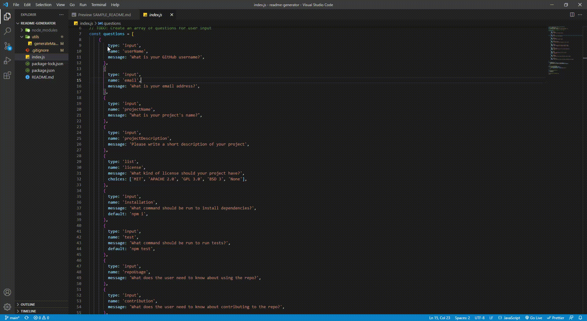

# Readme-Generator
  

  ## Description

  Command line application that uses the inquirer npm package to prompt questions to the user about project information, then using that information to generate a professional README file.
  
  ## Table of Contents 
  
  * [Installation](#installation)
   
 * [License](#license)
  
  * [Tests](#tests)
  
  * [Questions](#questions)
  
  ## Installation
  To install dependencies, run the following:
  `
  npm i
  `
  ## Usage 
  
  

  ## License
  
    This repository is licensed under the MIT license 

  ## Tests
  To run tests, run the following:
  `
  npm test
  `
  ## Questions
  Questions about this repository? Please contact me at [mohamed.lazrekb@gmail.com](mailto:mohamed.lazrekb@gmail.com). View more of my work in GitHub at [lazrekm](https://github.com/lazrekm) 
  
